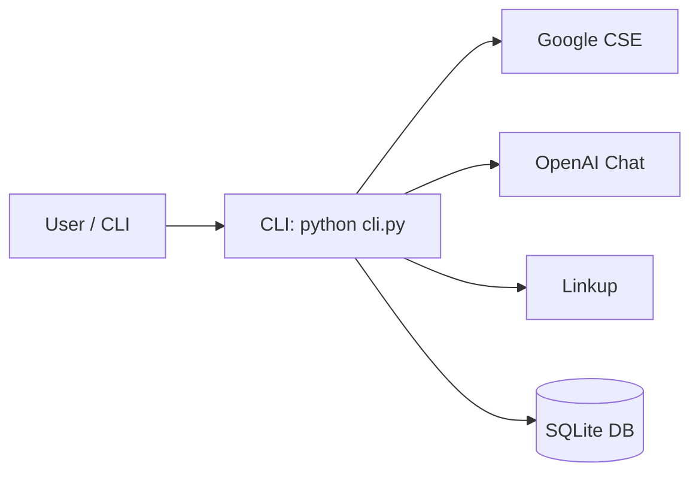
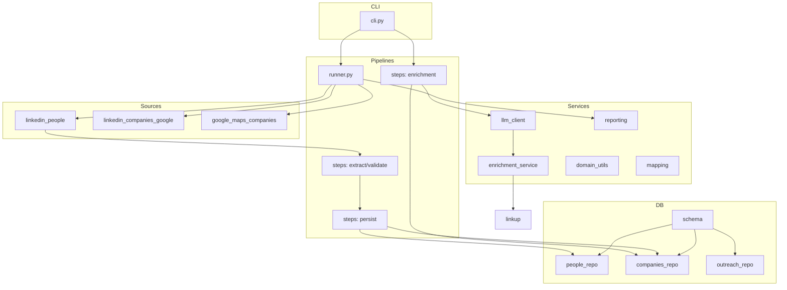
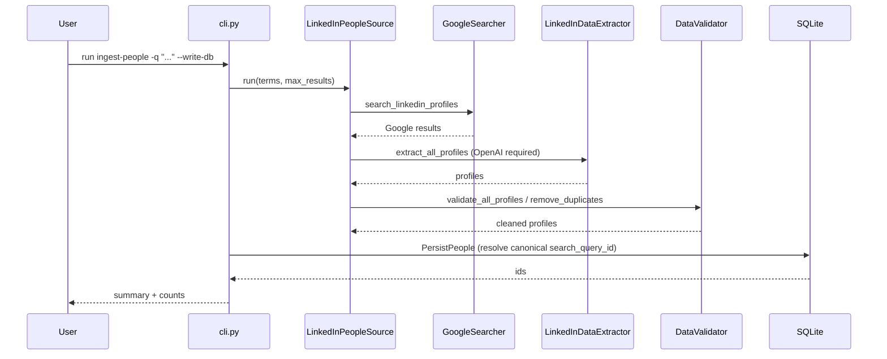
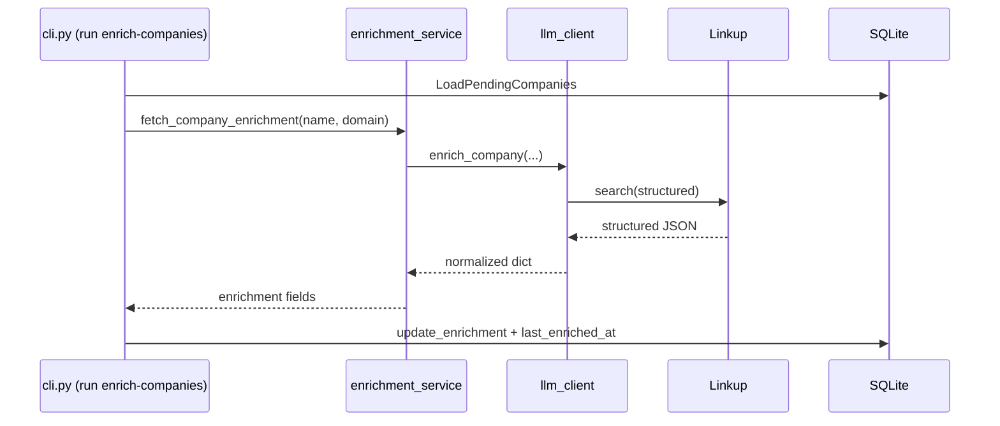
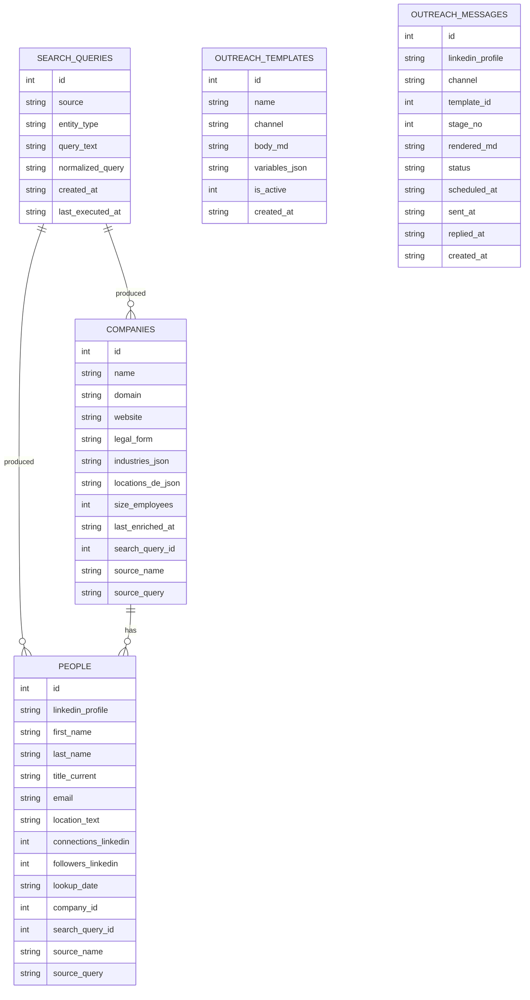

## Software Architecture

### Purpose
Provide an accurate, visual-first description of the system so newcomers can understand key flows, change the code safely, and operate it locally and in CI.

### Scope and Audience
- For developers and stakeholders of the LinkedIn Lead Generation CLI and pipelines.
- Out-of-scope: browser automation and LinkedIn scraping; production cloud deployment.

## Context (C4 Level 1)

Takeaway: the CLI orchestrates Google Search, AI extraction, optional Linkup enrichment, and writes to SQLite.

## Containers (C4 Level 2)

Key files: `cli.py`, `pipelines/runner.py`, `pipelines/steps/*`, `sources/*`, `services/*`, `db/*`, `config/*`.

## Components (C4 Level 3)

### People Ingestion runtime

### Company Enrichment runtime

## Data Model and Lifecycle

Tables: `people`, `companies`, `search_queries`; view `v_people_with_company`; outreach tables `outreach_templates`, `outreach_messages`.

Invariants: `people.linkedin_profile` UNIQUE and normalized; `companies.domain` UNIQUE when known.

## Responsibilities and Constraints
- Extraction requires OpenAI. `pipelines/steps/extract_data.py` enforces AI usage and raises when `OPENAI_API_KEY` is missing.
- Enrichment defaults to Linkup (`config/llm_routes.py`) and needs `LINKUP_API_KEY`.
- Persistence is idempotent by `linkedin_profile` and `domain`. Normalization via `services/domain_utils.normalize_linkedin_profile_url` and `extract_apex_domain`.
- Canonical query linkage: pipelines find-or-create `search_queries` and set `people.search_query_id` (and for companies as pipelines are added).

## Deployment and Operations
- Config via `.env` loaded by `config/settings.py`:
  - AI: `AI_ENABLED`, `AI_PROVIDER` (stub|openai|linkup), `OPENAI_MODEL`, `OPENAI_API_KEY`, `LINKUP_API_KEY`.
  - Google: `GOOGLE_API_KEY`, `GOOGLE_CSE_ID`, `GOOGLE_SEARCH_URL`, rate/timeout limits.
  - Runtime: `DB_PATH`, `RUN_ENV`, `LOG_LEVEL`, `DEMO`.
  - Tracing: `LLM_TRACE`, `LLM_LOG_PATH`.
- Observability: LLM calls logged to `logs/llm_calls.jsonl` when tracing enabled. `RUN_ID` set in `cli.py` and propagated to logs.
- Failure modes: Google quota, OpenAI failures, Linkup unavailability, DB locks. Prefer fail-fast with clear messages and continue-on-error where safe in persistence.

### Data Retention (brief)
- Keep personal profile data only as long as needed for outreach experiments.
- If a profile is no longer needed, remove it (e.g., via a simple SQL DELETE on `people` and related outreach rows). A fuller deletion/export tool can be added if required later.

## Decisions (ADR summaries)
- AI extraction is required for people ingestion (accuracy over cost).
- Enrichment provider is Linkup by default; OpenAI enrichment path removed in `services/llm_client.py`.
- Website discovery for enrichment uses domain prediction + Linkup; no general web-scraping in core.
- Query tracking uses a canonical `search_queries` table with FKs in `people` (and later `companies`), keeping the design KISS-ready with optional future upgrades (run history, M:N attribution).

## Commands (Reproduce Flows)
- Bootstrap DB: `python cli.py bootstrap`
- Ingest people (no DB): `python cli.py run ingest-people -q "Senior Engineer Berlin" -m 5`
- Ingest people (DB write): `python cli.py run ingest-people -q "Senior Engineer Berlin" -m 5 --write-db`
- Enrich companies: `python cli.py run enrich-companies --limit 5 --progress`
- Reports: `python cli.py report-recent --limit 5` | `python cli.py report-person --profile https://linkedin.com/in/<slug>`
- Hygiene: `python cli.py dedupe-people`

## Cross-References (Code)
- Entry: `cli.py`, `pipelines/runner.py`
- Steps: `pipelines/steps/extract_data.py`, `validate_data.py`, `validate_people.py`, `persist_people.py`, `validate_companies.py`, `persist_companies.py`, `enrich_companies.py`
- Services: `services/llm_client.py`, `services/enrichment_service.py`, `services/mapping.py`, `services/domain_utils.py`, `services/reporting.py`
- Sources: `sources/linkedin_people.py`, `sources/google_maps_companies.py`, `sources/linkedin_companies_google.py`, `sources/registry.py`, `google_searcher.py`
- DB: `db/schema.py`, `db/repos/people_repo.py`, `db/repos/companies_repo.py`, `db/repos/outreach_repo.py`
- Config: `config/settings.py`, `config/llm_routes.py`

## How to Update
- When code changes significant flows or schemas, update the appropriate diagram and the Commands section. Keep diagrams short and focused per flow.

